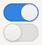

:::warning

**Disclaimer:** This post is just a record of my tests, investigations and speculations. Things might evolve and change as technology changes. Remember to verify your assumptions and test your code.

:::

Some time ago, I learned about an interesting HTML pattern by wandering through [the spec](https://html.spec.whatwg.org/):

```html
<label for="btn">Hello World</label>
<button type="button" id="btn"></button>
```

What I didn't know until then is that `button` is a [labelable element](https://html.spec.whatwg.org/multipage/forms.html#category-label) and thus it can be referenced with the `for` attribute of a `label`.

Since this looked like an exotic pattern to me, I did some research and found that the pattern is actually well supported by browsers and most screen readers but not so well supported by voice control software. 

My initial guess was that, depending on the requirements, there are probably more established patterns out there, like using `id` and `aria-labelledby`. Nonetheless, this pattern stuck in my mind.

## And then came The Switch

Now, the example above doesn't make much sense, and I didn't encounter it *in the wild* until recently when I found an implementation of it looking at the examples of the `Switch` component in the [shadcn documentation](https://ui.shadcn.com/docs/components/switch) (I cleaned it up to make it more readable): 


```html
<button 
	type="button" 
	role="switch" 
	aria-checked="false" 
	value="on" 
	id="airplane-mode"
>
</button>
<label for="airplane-mode">Airplane Mode</label>
```

The markup is very close to my first snippet, with the relevant addition of the `switch` role and the related `aria-checked` attribute. These additions tell assistive technologies that the control is a [switch](https://www.w3.org/TR/wai-aria/#switch). 

Around the web, you might find the control also called <i>toggle</i> or <i>toggle switch</i>, but this is how it would usually look like:

<figure>


  <figcaption>Switches &dash; <a href="https://commons.wikimedia.org/wiki/File:GtkSwitch.png">Wikimedia Commons</a> </figcaption>
</figure>

Since shadcn is based on [Radix UI](https://www.radix-ui.com/primitives), a pretty established React library with a focus on accessibility, I decided to embark on a journey to see what other popular libraries were doing and how widespread the *labeled button* pattern was.

### Introduction to switches

Before starting the journey, let's try to understand what a <i>switch</i> is, because the control itself is also pretty interesting from a User Experience point of view. 

It clearly is a [skeuomorphism](https://www.interaction-design.org/literature/topics/skeuomorphism) of physical [toggle switches](https://en.wikipedia.org/wiki/Switch#Toggle_switch) and it was probably popularized by the [iOS interface](https://developer.apple.com/design/human-interface-guidelines/toggles). 

In many cases, the expected behavior for this control is to immediately have an effect on the system. For example, we expect a switch for airplane mode to immediately turn it on or off without having to press a save button. 

This is where the application of this UI pattern to the web changes: a switch can both have immediate effect or be part of a submittable form (thus behaving almost like a checkbox). Let's keep this in mind for later.

### Web switches

When it comes to the web, there's extensive literature about accessible switches and toggle buttons (for example: [Updated Switch script & more](https://www.scottohara.me/note/2019/04/03/switch-script.html), [Toggle Buttons
](https://inclusive-components.design/toggle-button/), [An accessible toggle](https://kittygiraudel.com/2021/04/05/an-accessible-toggle/#button-variant)).

Even if their semantics are slightly different, the names are [used interchangeably in design systems](https://component.gallery/components/toggle/). 

There are two ongoing initiatives for native switch controls: [OpenUI toggle](https://open-ui.org/components/switch.explainer/) and [switch attribute](https://github.com/whatwg/html/pull/9546), the latter one being [already shipped in Safari 17.4](https://webkit.org/blog/15054/an-html-switch-control/). But for now, the most effective patterns are:

```html
<!-- 1) HTML base is a checkbox -->  
<label for="switch">Airplane mode</label>
<input type="checkbox" id="switch" role="switch" aria-checked="false" />

<!-- 2) HTML base is a button -->
<label id="switch-label">Airplane mode</label>
<button aria-labelledby="switch-label" role="switch" aria-checked="false"></button>

```

#### Screen readers

For both patterns, NVDA and VoiceOver and other screen readers would sound like (you can check it on [CodePen](https://codepen.io/marco_solazzi/full/jENojxL)):

```
Airplane mode off switch
```

Not all screen readers/browser pairs support these patterns though. For example, Narrator in every browser except Edge identifies the switch as `button, off` (probably because Narrator is mostly tailored for Edge users): as always, build with your target audience in mind.

#### System architecture

From a system architecture perspective, the first pattern is probably preferable in cases where the switch's state change is part of a submittable form. This is because <b>the checkbox's value is submitted with all other fields</b> (which is a good practice for progressive enhancement). This approach becomes even more relevant with concepts like [React Server Functions](https://react.dev/reference/react-dom/components/form#handle-form-submission-with-a-server-function).

The second pattern is instead more suitable when we want the state change to have an <b>immediate effect</b> since that's an expected behavior of the underlying `button` element.  

#### The "labeled control side effect"

Another big difference, at least from the user agent point of view, is that in the first example the `label` has an associated [labeled control](https://html.spec.whatwg.org/multipage/forms.html#labeled-control) (the checkbox), while in the second **it's just a caption for the button**.

It might seem a semantic subtlety, but there is a rather interesting side effect: interacting with the label of a labeled control **triggers events on the control itself**. 

For example, in most browsers, clicking the label of a checkbox will change the checkbox's state, as if we directly clicked on the control. This is not the case when we associate a label and a control using `aria-labelledby`.

So, if we change the second snippet to:

```html
<!-- 2) HTML base is a button -->
<label for="switch-btn">Airplane mode</label>
<button id="switch-btn" role="switch" aria-checked="false"></button>
```

now clicking on the label triggers the button `click` event (you can test the behavior in [this CodePen](https://codepen.io/marco_solazzi/pen/bNGEgPM)). 

<p class="codepen" data-height="300" data-default-tab="result" data-slug-hash="bNGEgPM" data-pen-title="Toggle Switches" data-preview="true" data-user="marco_solazzi" style="height: 300px; box-sizing: border-box; display: flex; align-items: center; justify-content: center; border: 2px solid; margin: 1em 0; padding: 1em;">
  <span>See the Pen <a href="https://codepen.io/marco_solazzi/pen/bNGEgPM">
  Toggle Switches</a> by Marco Solazzi (<a href="https://codepen.io/marco_solazzi">@marco_solazzi</a>)
  on <a href="https://codepen.io">CodePen</a>.</span>
</p>
<script async src="https://public.codepenassets.com/embed/index.js"></script>

In the context of a form with many inputs, this behavior might contribute to the consistency of the user experience by making the switch feel more *native*. 

Anyway, as I previously mentioned, some accessibility software might not fully support this pattern. We'll see later how component libraries are trying to solve the problem.

## Switches in the wild

Now that we've covered the basics of switches and their implementation patterns, I'd like to see what other popular component libraries are doing for the same component. 

I will focus on React, Vue, and Angular since they seem to [have the highest market share](https://2024.stateofjs.com/en-US/libraries/front-end-frameworks/) in the JavaScript ecosystem. My choice of library is a mix of [surveys](https://2024.stateofreact.com/en-US/libraries/component-libraries/) and other [sources](https://bestofjs.org/projects?page=1&limit=30&tags=component&sort=monthly-downloads). 

::caption[React Libraries]
| Library                                                                      | Pattern                                                       |
| ---------------------------------------------------------------------------- | ------------------------------------------------------------- |
| [MUI](https://mui.com/material-ui/react-switch/#label)                       | `label > input[type=checkbox]`                                |
| [shadcn/ui + Radix Primitives](https://ui.shadcn.com/docs/components/switch) | `label[for] + button[role=switch]`                            |
| [Headless UI](https://headlessui.com/react/switch#adding-a-label)            | `label[for] + button[role=switch][aria-labelledby] `          |
| [Chakra UI](https://chakra-ui.com/docs/components/switch)                    | `label > input[type=checkbox] `                               |
| [React Aria](https://react-spectrum.adobe.com/react-aria/Switch.html)        | `label > input[type=checkbox][role=switch]` (no aria-checked) |

::caption[Vue Libraries]

| Library                                                            | Pattern                                          |
| ------------------------------------------------------------------ | ------------------------------------------------ |
| [Vuetify](https://vuetifyjs.com/en/components/switches/#usage)     | `label[for] + input[type=checkbox]`              |
| [Element Plus](https://element-plus.org/en-US/component/form.html) | `label[for] + input[type=checkbox][role=switch]` |
| [Radix Vue](https://www.radix-vue.com/components/switch.html)      | `label[for] + button[role=switch][aria-label]`   |

::caption[Angular Libraries]

| Library                                                                                      | Pattern                                             |
| -------------------------------------------------------------------------------------------- | --------------------------------------------------- |
| [Angular Material](https://material.angular.io/components/slide-toggle/overview)             | `label[for] + button[role=switch][aria-labelledby]` |
| [Nebular](https://akveo.github.io/nebular/docs/components/toggle/examples#nbtogglecomponent) | `label > input[type=checkbox][role=switch]`         |

::caption[Multi-framework Libraries]

| Library                                                                      | Pattern                                               |
| ---------------------------------------------------------------------------- | ----------------------------------------------------- |
| [Bootstrap](https://getbootstrap.com/docs/5.3/forms/checks-radios/#switches) | `label[for] + input[type=checkbox][role=switch]`      |
| [Prime(NG,React,Vue)](https://www.primefaces.org/)                           | `label[for] + input[type=checkbox][role=switch]`      |
| [Ark UI](https://ark-ui.com/react/docs/components/switch)                    | `label[for] +  input[type=checkbox][aria-labelledby]` |

## Results

After investigating these libraries, a clear result emerges: as I suspected, **most of the library authors chose a more conservative pattern** using a `label` and a checkbox with (or without) the `switch` role. 

However, even if it might seem that the `label + button` pattern isn't used a lot, we need to remember that React is the most popular JavaScript library, [shadcn and Radix have large adoption](https://npmtrends.com/@headlessui/react-vs-@mui/material-vs-@radix-ui/primitive-vs-react-bootstrap), and Headless UI is used in [Tailwind's own premium UI library](https://tailwindui.com/components). 

So, from a numerical perspective, there may be a significant number of web applications using the *labeled button* pattern.

### Accessibility testing results

In my quick tests using VoiceOver, NVDA, and Narrator, all these patterns worked as expected. The screen readers correctly reported switches and checkboxes along with their states, with one exception: NVDA on Firefox reports Element Plus as <samp>blank</samp>. I didn't investigate this issue in depth, but it might be related to how the library hides the native input element (see a [similar topic for PrimeFaces](https://github.com/nvaccess/nvda/discussions/16398)). 

<details>
  <summary>Tests output log</summary>
  
- MUI
  - Safari 18 + VoiceOver: <samp>Airplane mode unchecked checkbox</samp>
  - Chrome 133 + VoiceOver: <samp>Airplane mode unchecked checkbox</samp>
  - Chrome 133  + NVDA 2024.1: <samp>Airplane mode checkbox not checked</samp>
  - Firefox 135 + NVDA 2024.1: <samp>clickable Airplane mode checkbox not checked</samp>
  - Edge 133 + Narrator: <samp>Airplane mode checkbox unchecked</samp>
- shadcn/ui + Radix Primitives
  - Safari 18 + VoiceOver: <samp>Airplane Mode off switch</samp>
  - Chrome 133  + VoiceOver: <samp>Airplane Mode off switch</samp>
  - Chrome 133  + NVDA 2024.1: <samp>Airplane Mode switch off</samp>
  - Firefox 135 + NVDA 2024.1: <samp>Airplane Mode switch off</samp>
  - Edge 133 + Narrator: <samp>Airplane Mode switch off</samp>
- Headless UI
  - Safari 18 + VoiceOver: <samp>Airplane mode off switch</samp>
  - Chrome 133 + VoiceOver: <samp>Airplane mode off switch</samp>
  - Chrome 133  + NVDA 2024.1: <samp>Airplane Mode switch off</samp>
  - Firefox 135 + NVDA 2024.1: <samp>Airplane Mode switch off</samp>
  - Edge 133 + Narrator: <samp>Airplane Mode switch off</samp>
- Chakra UI
  - Safari 18 + VoiceOver: <samp>Airplane mode unchecked checkbox</samp>
  - Chrome 133 + VoiceOver: <samp>Airplane mode unchecked checkbox</samp>
  - Chrome 133  + NVDA 2024.1: <samp>clickable Airplane mode checkbox not checked</samp>
  - Firefox 135 + NVDA 2024.1: <samp>clickable Airplane mode checkbox not checked</samp>
  - Edge 133 + Narrator: <samp>Airplane mode checkbox unchecked</samp>
- React Aria 
  - Safari 18 + VoiceOver: <samp>Airplane mode off switch</samp>
  - Chrome 133 + VoiceOver: <samp>Airplane mode off switch</samp>
  - Chrome 133  + NVDA 2024.1: <samp>clickable Airplane switch off</samp>
  - Firefox 135 + NVDA 2024.1: <samp>clickable Airplane switch off</samp>
  - Edge 133 + Narrator: <samp>Airplane mode off switch</samp>

- Vuetify
  - Safari 18 + VoiceOver: <samp>Airplane mode unchecked checkbox</samp>
  - Chrome 133 + VoiceOver: <samp>Airplane mode unchecked checkbox</samp>
  - Chrome 133  + NVDA 2024.1: <samp>clickable Airplane mode checkbox not checked</samp>
  - Firefox 135 + NVDA 2024.1: <samp>clickable Airplane mode checkbox not checked</samp>
  - Edge 133 + Narrator: <samp>Airplane mode checkbox unchecked</samp>
- Element Plus
  - Safari 18 + VoiceOver: <samp>Airplane Mode off switch</samp>
  - Chrome 133  + VoiceOver: <samp>Airplane Mode off switch</samp>
  - Chrome 133  + NVDA 2024.1: <samp>clickable Airplane Mode switch off</samp>
  - Firefox 135 + NVDA 2024.1: <samp>blank</samp>
  - Edge 133 + Narrator: <samp>Airplane Mode switch off</samp>
- Radix Vue
  - Safari 18 + VoiceOver: <samp>Airplane mode off switch</samp>
  - Chrome 133 + VoiceOver: <samp>Airplane mode off switch</samp>
  - Chrome 133  + NVDA 2024.1: <samp>Airplane Mode switch off</samp>
  - Firefox 135 + NVDA 2024.1: <samp>Airplane Mode switch off</samp>
  - Edge 133 + Narrator: <samp>Airplane Mode switch off</samp>

- Angular Material
  - Safari 18 + VoiceOver: <samp>Airplane Mode off switch</samp>
  - Chrome 133 + VoiceOver: <samp>Airplane Mode off switch</samp>
  - Chrome 133  + NVDA 2024.1: <samp>Airplane Mode switch off</samp>
  - Firefox 135 + NVDA 2024.1: <samp>Airplane Mode switch off</samp>
  - Edge 133 + Narrator: <samp>Airplane Mode switch off</samp>
- Nebular
  - Safari 18 + VoiceOver: <samp>Airplane Mode off switch</samp>
  - Chrome 133  + VoiceOver: <samp>Airplane Mode off switch</samp>
  - Chrome 133  + NVDA 2024.1: <samp>Airplane Mode switch off</samp>
  - Firefox 135 + NVDA 2024.1: <samp>clickable Airplane Mode switch off</samp>
  - Edge 133 + Narrator: <samp>Airplane Mode switch off</samp>

</details>


I created some rough demo environments, grouping most of the libraries I tested. You can check them out at the following links:

- [React Libraries](https://stackblitz.com/edit/stackblitz-starters-nia25dtm?file=src%2Fapp%2Fpage.tsx)
- [Vue Libraries](https://stackblitz.com/edit/vitejs-vite-v3yn29k8?file=src%2FApp.vue)
- [Angular Libraries](https://stackblitz.com/edit/stackblitz-starters-pgadhces?file=src%2Fapp%2Fapp.component.html)


I also noticed some interesting details:

- MUI, Vuetify, and Chakra UI (as well as Ark UI, which is developed under the same org) implementations of the switch are basically <b>just visual</b>: the underlying controls are simply labeled checkboxes. While this makes the accessibility information less consistent with its on-screen appearance, as [MUI documentation states](https://mui.com/material-ui/react-switch/#accessibility), the choice of not using the switch role is conservative, to widen the range of supported devices.
- React Aria doesn't set the `aria-checked` attribute that [should be required](https://www.w3.org/TR/wai-aria/#switch); nevertheless, in all my tests, screen readers were able to pick the state from the underlying checkbox.
- Headless UI and Angular Material use the same implementation as shadcn/ui (the *labeled button*) but with a twist: they introduce a redundancy where the label is referenced in the button via the `aria-labelledby` attribute.

### Redundant labeling

The redundant labeling pattern from the previous section  deserves a closer look, as it represents an interesting approach to usability and accessibility.

Here is a simplified snippet as reference:

```html
<label for="switch" id="switch-label">Airplane mode</label>
<button id="switch" role="switch" aria-labelledby="switch-label" aria-checked="false"></button>
```

Earlier we said that some accessibility software might not properly compute the name of buttons associated with labels with the `for` attribute, so, since `aria-*` attributes have precedence in the [computation of accessible names](https://www.stefanjudis.com/today-i-learned/the-order-of-accessible-name-computation-steps/), we should have solved those issues. 

The `for` attribute is then only used to <b>leverage the labeled control trigger side effect</b> (as [reported in this PR](https://github.com/tailwindlabs/headlessui/pull/2265)). 

Anyway, I couldn't test the accessibility of this pattern, so **I can't 100% vouch for it**.

## Takeaways

After this long journey through switch implementations, I can summarize my findings in four key insights:

- The *labeled button* pattern, while fascinating to discover in the HTML spec, remains somehow exotic in practice. However, its usage with a [redundant labeling](#redundant-labeling) could make it a fair alternative to more traditional patterns.
- Because UI libraries abstract away the HTML implementation, you end up living in a world (that of `<Switches />`, `<Tabs />` and `<Menubar />`) disconnected from the real medium you're writing for: In all the test scenarios you are writing a variation on `<Switch />` but the _real_ markup is hidden away. 
- When we delegate our design choices to someone else, **we don't know the impact on the user experience**. Small changes in the markup can fundamentally change how users perceive and interact with an interface.
- The libraries I explored emphasize their accessibility and indeed provide a good baseline, but as we've seen, there are often many possible ways to make a control "accessible" &mdash; each with its own assumptions and caveats. Don't rely blindly on any library; **do some research based on your specific needs**.

