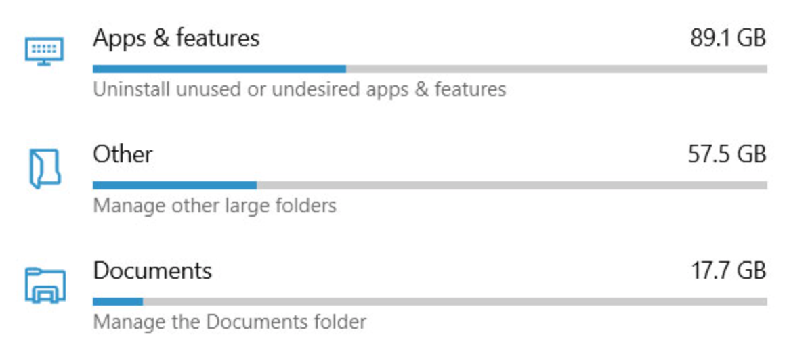

In the last few years HTML and CSS have grown to a point where it's almost possible to describe every common UI pattern. In this spirit, I recently embarked on a new experiment during my off times: styling the native `<meter>` element as a bar with specific colors for some of its states using only valid HTML and CSS.

What sent me down this path was a concrete UI requirement: re-create the credits/usage bar you see in many contexts like subscription products, system usage overview, etc. It's a bar showing how much of your quota is used, that shifts color as you approach the limit.

<figure>



  <figcaption>Windows disk usage meters</figcaption>
</figure>

It's a common enough pattern that I expected a ready-made component for it. Instead I found that most UI libraries reach for the wrong native primitive, or skip native primitives entirely.

## Is it a progress bar?

By looking at some of the popular libraries, it might seem that this kind of UI element is called <i>Progress</i>. For example, both [shadcn/ui](https://ui.shadcn.com/docs/components/base/progress) and [Bootstrap](https://getbootstrap.com/docs/4.0/components/progress/) have a Progress component and both apply a `role="progressbar"` to it. While it might be tempting to use these components, in reality a progressbar (or the HTML native counterpart, `<progress>`) is <strong>the wrong element for the task</strong>:

<figure>

> The `progress` element represents the completion progress of a task.

<figcaption>HTML spec - <cite><a href="https://html.spec.whatwg.org/multipage/form-elements.html#the-progress-element">4.10.13 The progress element</a></cite></figcaption>
</figure>

<figure>

> An element that displays the progress status for tasks that take a long time.
>
> A `progressbar` indicates that the user's request has been received and the application is making progress toward completing the requested action.

<figcaption>WAI-ARIA 1.2 spec - <cite><a href="https://www.w3.org/TR/wai-aria-1.2/#progressbar">`progressbar` role</a></cite></figcaption>
</figure>

Instead, the HTML spec is very clear on what we should use:

<figure>

> The `progress` element is the wrong element to use for something that is just a gauge, as opposed to task progress. For instance, indicating disk space usage using progress would be inappropriate. Instead, the `meter` element is available for such use cases.

<figcaption>HTML spec - <cite><a href="https://html.spec.whatwg.org/multipage/form-elements.html#the-progress-element">4.10.13 The progress element</a></cite></figcaption>
</figure>

## Implementation

From this I started experimenting with the `<meter>` element to see how far I could push a nice implementation of a usage meter using just HTML and CSS.

:::warning

**Disclaimer**: What follows is a CSS experiment. Accessibility and old browser compatibility haven't been fully tested.

:::

### Requirements

For this experiment, my requirements are:

1. The bar should have <b>rounded corners</b> (both the container and the actual meter bar).
1. The bar has three states defined by color codes: <b>default</b>, <b>warning (optional)</b>, and <b>max</b>.

### TL;DR

If you're just curious to see the finished implementation, here's the codepen:

<p class="codepen" data-height="300" data-pen-title="Colorized meter" data-preview="true" data-default-tab="result" data-slug-hash="emgKdYy" data-user="marco_solazzi" style="height: 300px; box-sizing: border-box; display: flex; align-items: center; justify-content: center; border: 2px solid; margin: 1em 0; padding: 1em;">
  <span>See the Pen <a href="https://codepen.io/marco_solazzi/pen/emgKdYy">
  Colorized meter</a> by Marco Solazzi (<a href="https://codepen.io/marco_solazzi">@marco_solazzi</a>)
  on <a href="https://codepen.io">CodePen</a>.</span>
</p>
<script async src="https://public.codepenassets.com/embed/index.js"></script>

### HTML setup

The `<meter>` element already gives me all the features I need to fulfill the requirements:

```html
<label for="meter">Meter</label>
<meter min="0" max="200" value="100" high="150" id="meter"></meter>
```

Think of `value` as the current usage, `max` as the maximum allowed usage, and `high` as the threshold at which a system would want to nudge you with a warning before you actually run out of space.

And that's it for the HTML part. But if you are using this for something other than just plain numbers, it's a good idea to **add at least a [visually hidden](https://www.w3.org/WAI/WCAG22/Techniques/css/C7), human-readable description for accessibility**. For a more in-depth review of this subject, please read this 2022 [article about `<meter>` accessibility by Dana Byerly](https://www.htmhell.dev/adventcalendar/2022/5/#:~:text=Using%20visually%20hidden%20text%20instead%20of%20fallback).

In my case, I used the text as a visual description of the meter value and positioned it with [Anchor positioning](https://developer.mozilla.org/en-US/docs/Web/CSS/Guides/Anchor_positioning/Using).

```html
<label for="meter">Disk Usage</label>
<meter
  min="0"
  max="200"
  value="100"
  high="150"
  id="meter"
  aria-describedby="description"
></meter>
<span id="description">100GB out of 200GB</span>
<style>
  /* Anchor the description at the top/right of the meter */
  meter {
    anchor-name: --meter;
  }
  #description {
    position: absolute;
    position-anchor: --meter;
    inset-block-end: calc(anchor(start) + 0.25rem);
    inset-inline-end: anchor(end);
  }
</style>
```

### Design choices

- No gradients between states, just a hard swap with a short transition.
- Firefox and Chromium/WebKit each expose their own set of pseudo-elements for `<meter>`, so both sets need to be reset and re-styled independently.

### Technical implementation

Now, for the CSS implementation, I used some new CSS features:

- [Typed `attr()`](https://developer.chrome.com/blog/advanced-attr): reads an HTML attribute straight into a CSS custom property as a real `<number>`, not a string
- [`if()`](https://developer.mozilla.org/en-US/docs/Web/CSS/if) with [`style()` queries](https://developer.mozilla.org/en-US/docs/Web/CSS/Reference/At-rules/@container#container_style_queries): sets a native conditional for choosing a value based on comparing two custom properties

Since not all browsers support `if()` and typed `attr()` at the time of writing, I added a fallback using more widely available web features:

- [`sign()`](https://developer.mozilla.org/en-US/docs/Web/CSS/sign) and [`clamp()`](https://developer.mozilla.org/en-US/docs/Web/CSS/clamp): used together to compute a 0/1/2 state number mapping the three states of the meter
- [`color-mix()`](https://developer.mozilla.org/en-US/docs/Web/CSS/color_value/color-mix), nested twice: turns that state number into an actual state color

### The cleaner path

Typed `attr()` and `if()` make the code straightforward and easier to maintain, but they still have limited support at the time of writing.

Plain `attr()` has existed in CSS for a long time, but it only ever returned a string. [Typed `attr()`](https://developer.chrome.com/blog/advanced-attr) lets you specify the expected type (and an optional fallback):

:::snippetdescription

```css
meter {
  /* Set the custom properties only if the browser supports typed attributes */
  @supports (x: attr(x type(*))) {
    --value: attr(value type(<number>), 0);
    --max: attr(max type(<number>), infinity);
    --threshold: attr(high type(<number>), var(--max));
  }

  /* ... */
}
```

- **line 4:** By default, <var>--value</var> is `0` if not defined in the HTML.
- **line 5:** When <var>--max</var> is not defined elsewhere, fall back to `infinity` to drop all color codes and just render the default color.
- **line 6:** The threshold can be set using `<meter>`'s attribute `high`. Defaults to <var>--max</var> as per [HTML spec](https://developer.mozilla.org/en-US/docs/Web/HTML/Reference/Elements/meter#high).

:::

Once <var>--value</var>, <var>--max</var>, and <var>--threshold</var> are numbers, we can use `if()` and style queries to assign the correct color for each state:

<!-- prettier-ignore-start -->
```css
meter {
  --bar-color: if(
    style(--value = --max): var(--color-alert);
    style(--value >= --threshold): var(--color-warning);
    else: var(--color-default);
  );
}
```
<!-- prettier-ignore-end -->

The previous code block reads, top to bottom, like a switch statement: full value → alert, past threshold → warning, otherwise the default color.

### Typed attributes fallback

In browsers without typed `attr()` support, custom properties won't be set correctly, but we can assign them manually via JavaScript by reading the value of each attribute:

```js
// check for typed `attr()` support
const hasTypedAttr = CSS.supports('x', 'attr(x type(*))');
const $meter = document.querySelector('#meter');

if (!hasTypedAttr) {
  const update = () => {
    $meter.style.setProperty('--value', $meter.value);
    $meter.style.setProperty('--max', $meter.getAttribute('max'));
    $meter.style.setProperty('--threshold', $meter.getAttribute('high'));
  };

  // watch for changes on specific attributes
  // and manually update the fallback CSS custom properties
  const observer = new MutationObserver(update);
  observer.observe($meter, {
    attributes: true,
    attributeFilter: ['value', 'max', 'high'],
  });

  // sync the fallback custom properties
  // at DOM ready
  update();
}
```

I am using a [`MutationObserver`](https://developer.mozilla.org/en-US/docs/Web/API/MutationObserver) to keep the fallback CSS custom properties in sync with the attributes.

### Conditionals fallback: a sprinkle of hacky arithmetic

For browsers not supporting `if()`, there's no native <i>if/else</i> to fall back on, so the trick is to encode the three states as a single number and let math pick the color. Our new <var>--state</var> property ends up being <samp>0</samp> (default), <samp>1</samp> (warning), or <samp>2</samp> (alert):

:::snippetdescription

<!-- prettier-ignore-start -->

```css
meter {
  --state: clamp(
    0,
    calc(
      sign(var(--value) - var(--threshold) + 1) +
      sign(var(--value) - var(--max)) + 1
    ),
    2
  );
}
```

<!-- prettier-ignore-end -->

`sign()`: returns <samp>-1</samp>, <samp>0</samp>, or <samp>1</samp> depending on whether its argument is negative, zero, or positive:

- First `sign()` checks the threshold: `sign(value - threshold + 1)`
  - The `+ 1` shifts the comparison so that `value === threshold` counts as _already_ crossing into warning, not just approaching it.
  - Without that `+ 1`, hitting the threshold exactly would give `sign(0) = 0`, which reads as <i>still default</i>.
- Second `sign()` checks value against the maximum: `sign(value - max)`
  - This stays at <samp>0</samp> (no effect) until `value` reaches `max`, at which point it adds <samp>1</samp> more.
- The trailing `+ 1` sets the baseline, so with neither condition triggered, the total lands on <samp>0</samp>.

:::

Once we have computed the value of <var>--state</var> as a plain number, `color-mix()` turns it into the final color (note that we need to nest two `color-mix()` calls since [Chrome and Safari cap color-mix at two colors](https://caniuse.com/wf-color-mix-variadic)):

<!-- prettier-ignore-start -->
```css
meter {
  --bar-color: color-mix( 
    in srgb,
    var(--color-alert) max(0%, (var(--state) - 1) * 100%), 
    color-mix( 
      in srgb,
      var(--color-warning) min(100%, var(--state) * 100%), 
      var(--color-default) 
    )
  );
}
```
<!-- prettier-ignore-end -->

Let's walk through it for each value of <var>--state</var> to see how each color state is computed.

#### When `--state === 0`

<!-- prettier-ignore-start -->
```css {8}
meter {
  --bar-color: color-mix( 
    in srgb,
    var(--color-alert) max(0%, (0 - 1) * 100%), /* max(0%, -100%) -> 0% */
    color-mix(
      in srgb,
      var(--color-warning) min(100%, 0 * 100%), /* min(100%, 0%) -> 0% */
      var(--color-default) /* no percentage -> defaults to 100% */
    ) /* no percentage -> defaults to 100% */
  );
}
```
<!-- prettier-ignore-end -->

In the outer `color-mix()`, the first color's percentage computes to <samp>0%</samp>, so the final color will be determined only by the inner `color-mix()`. There, <var>--color-warning</var> has a computed percentage of <samp>0%</samp>, so the final color is <var>--color-default</var>.

#### When `--state === 1`

<!-- prettier-ignore-start -->
```css {7}
meter {
  --bar-color: color-mix(
    in srgb,
    var(--color-alert) max(0%, (1 - 1) * 100%), /* max(0%, 0%) -> 0% */
    color-mix(
      in srgb,
      var(--color-warning) min(100%, 1 * 100%), /* min(100%, 100%) -> 100% */
      var(--color-default) /* no percentage -> defaults to 0% */
    ) /* no percentage -> defaults to 100% */
  );
}
```
<!-- prettier-ignore-end -->

In the outer `color-mix()`, the first color's percentage still computes to <samp>0%</samp>. In the inner `color-mix()`, <var>--color-warning</var> has a computed percentage of <samp>100%</samp> and, since <var>--color-default</var> doesn't have an explicit percentage, it defaults to <samp>0%</samp>. The final color is <var>--color-warning</var>.

#### When `--state === 2`

<!-- prettier-ignore-start -->
```css {4}
meter {
  --bar-color: color-mix( 
    in srgb,
    var(--color-alert) max(0%, (2 - 1) * 100%), /* max(0%, 100%) -> 100% */
    color-mix( 
      in srgb,
      var(--color-warning) min(100%, 2 * 100%), /* min(100%, 200%) -> 100% */
      var(--color-default) /* no percentage -> defaults to 0% */
    ) /* no percentage -> defaults to 0% */
  );
}
```
<!-- prettier-ignore-end -->

In the outer `color-mix()`, the first color's percentage now computes to <samp>100%</samp>. In this case, the inner `color-mix()` value is irrelevant, since its percentage defaults to <samp>0%</samp>. The final color is <var>--color-alert</var>.

Overall, I think it's very clear that this implementation is harder to read and maintain than the one using `if()`.

### Applying the computed styles

Firefox and Chromium/WebKit expose `<meter>`'s internals through unrelated pseudo-elements, so both need resetting before the custom <var>--bar-color</var> can be applied:

```css
meter {
  /* Firefox Reset */
  &::-moz-meter-bar {
    appearance: none;
    background: none;
  }

  /* WebKit / Blink Reset */
  &::-webkit-meter-bar,
  &::-webkit-meter-inner-element,
  &::-webkit-meter-optimum-value,
  &::-webkit-meter-suboptimum-value,
  &::-webkit-meter-even-less-good-value {
    appearance: none;
    background: none;
  }

  /* Firefox styles */
  &::-moz-meter-bar {
    background: var(--bar-color);
    border-radius: 99em;
    transition: var(--transition);
  }

  /* WebKit / Blink style */
  &::-webkit-meter-bar {
    block-size: var(--bar-height);
  }

  &::-webkit-meter-suboptimum-value,
  &::-webkit-meter-optimum-value {
    background: var(--bar-color);
    border-radius: 99em;
    transition: var(--transition);
  }
}
```

## Final Thoughts

This was a fun experiment. The fallback part was pretty interesting and <i>satisfying</i> to code, even if I'd trade it a hundred times for the simplicity of an `if()` statement in production code.

While the implementation works across all major browsers, remember that this was just a quick experiment and that production-level code should go through extensive tests, especially when it comes to usability and accessibility.
